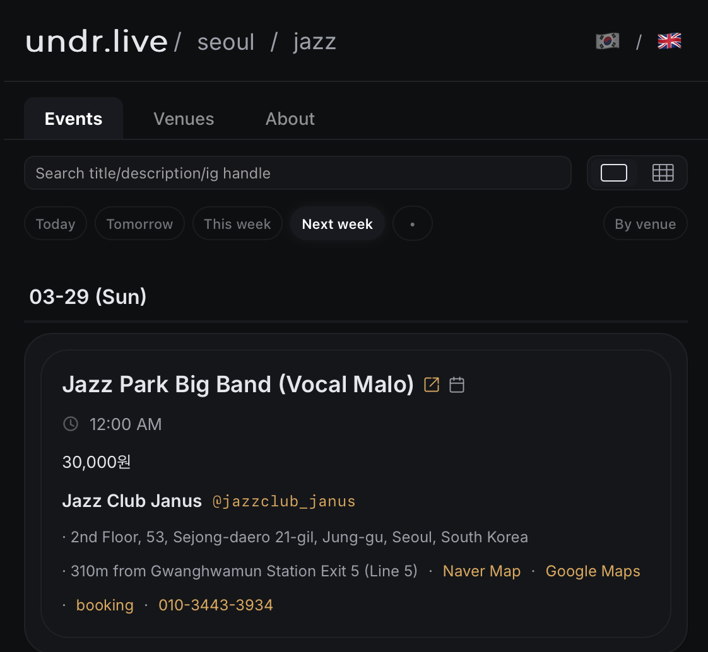
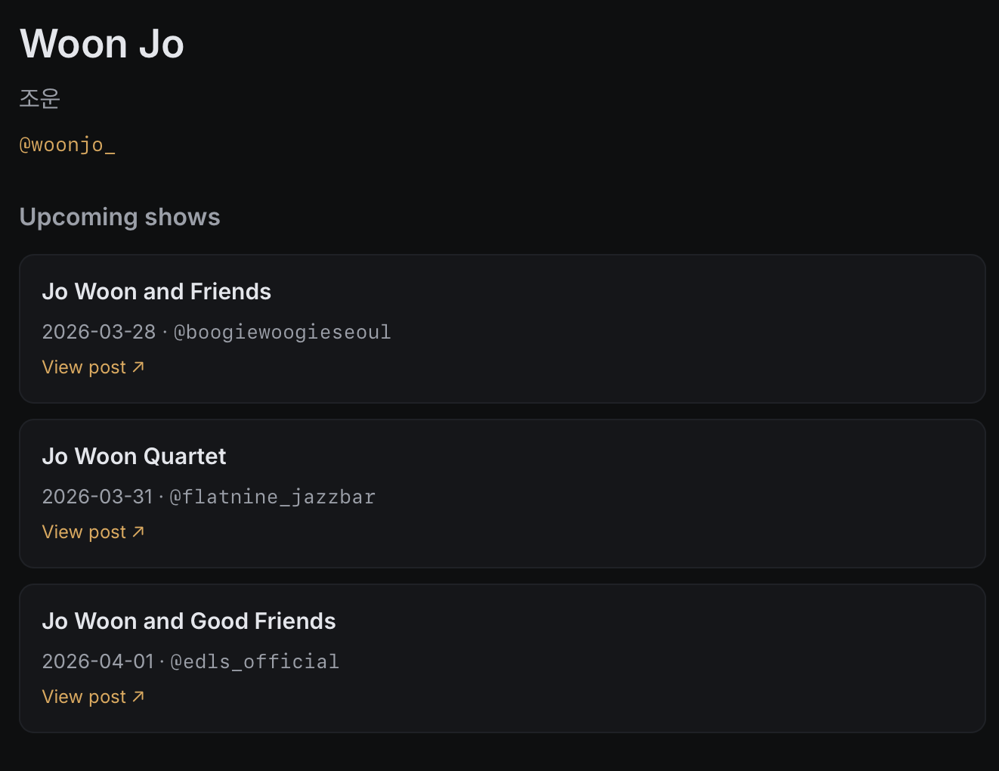
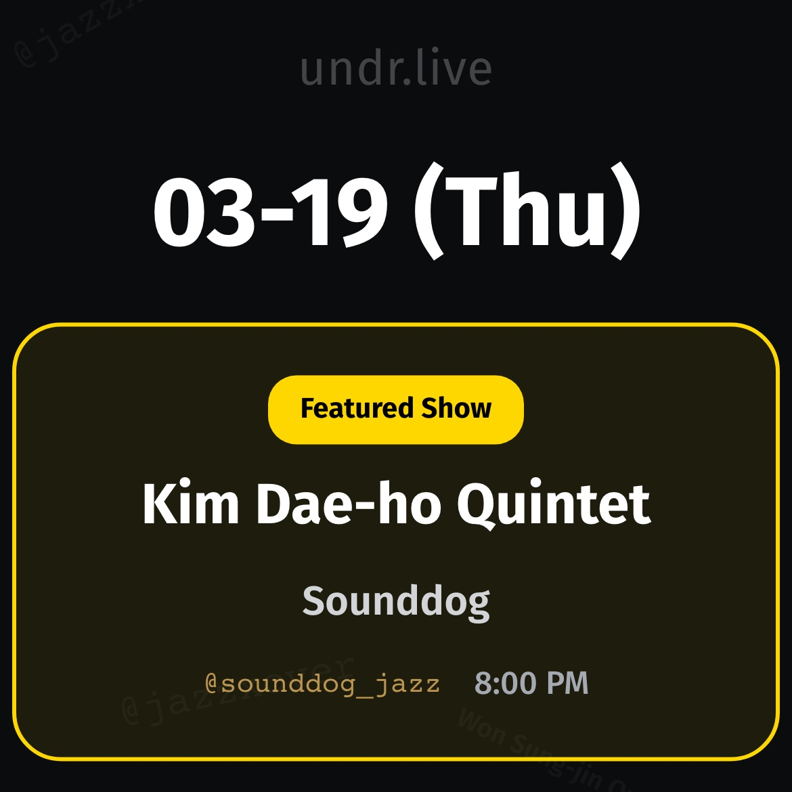

# undr.live — My Jazz Product, Four Months Later

A few months ago I launched [seoulunderground.live](https://keunwoochoi.github.io/post.html?id=2025-11-20-making-seoulunderground-live) — a site that scrapes jazz venue Instagram accounts in Seoul/South Korea and turns them into a browsable, free event calendar. This is a follow-up post, focusing on the product side.

## The New URL

`seoulunderground.live` → `undr.live`.

I chose the new, shorter URL. It's easier to say, type, and remember. It also took off "seoul", because I still dream about a global version of my service.

## Attempts to expand

According to my dream, I already should've expanded on two axes: genre and location. I tried two experiments:

**Electronics / Korea.** Technically, my pipeline worked. But I worried, and confirmed later, that I can't really imagine being a user of undr.live/electronics, since I'm not one of the target audience. I don't know who are competitors and how mature this area is (turned out there are, and things are better organized than I thought; perhaps because there is more money involved). I don't even know if the problem I'm solving exists for them. It was fun seeing a different color scheme that looks "electronics" to me, but I shut it down.

Good lesson: Fast and accurate decisions only happen when you know the domain. When you're bootstrapping, do what you deeply care about.

**Jazz / Germany.** I was in Germany for a month, so I used the opportunity to build undr.live/germany/jazz for me. Collecting some jazz venues' ig handles and let the pipeline work in German/English -- wow, so easy! Except, German jazz venues are not as active on Instagram as Korean ones. And I wasn't (and ain't) ready for non-ig sources. I turned it off.

(Quick observation: Korean jazz venues are IG-first because they're recent. The jazz boom in Seoul is rather new — most of these venues didn't exist five years ago, and therefore, they were born into Instagram. German jazz venues, on the other hand, are older. They also perhaps use Instagram less.)

## Automatic Instagram posting — finally.

In my first post I complained that I still had to post the daily show image to the [@undr.live](https://www.instagram.com/undr.live/) Instagram account manually, even though the screenshots were auto-generated and synced to my phone.

This is fixed now, thankfully without a 4-digit $$. New Mexico LLC is the answer! Now, every 1PM KST, the pipeline automatically:
1. Takes a screenshot of today's event table
2. Posts it to Instagram posts.
3. Oops.. it still doesn't support sending my post into story. So I do it manually, when I feel like. (I use my undr.live ig account more than my personal one, lol)

## IG marketing - WIP

I have an "IG marketing" pipeline now, which generates venue spotlight posts — a formatted carousel about a particular venue: its name, its vibe, its subgenre, upcoming shows. It's taking time refining the prompt to ensure the accuracy. I understood this as a limitation of LLMs (or at least my pipeline under my budget), as humans can clearly understand the vibe of a venue from venues' profile, videos, images, pictures of the interior, etc. Well, the world is not always built for me, and I'll figure this out.

## Musician DB — WIP

The site currently shows you events: when, where, who. But who are those musicians? Jazz fans care about this. So many jazz musician names, and I really want to unblock this barrier for the jazz noobies.

So I'm building a musician database. The pipeline discovers musician handles from event captions, fetches their posts, classifies them (is this actually a i) Korean ii) jazz musician?) using a local AI model running on my laptop, and filters them into a database. The ones that pass get connections mapped: which venues they play, who they play alongside.

As of now: ~100 musicians in the DB, hundreds of musician-venue connections mapped. The frontend piece — musician profiles, events linked to musicians — is still being built.

The longer-term vision: you find an event, you tap the musician's name, you get their profile with their regular venues and frequent collaborators. Intro to their music, website, YouTube channels, etc. 

## Show highlights — towards monetization?

I'm testing a "show highlights" section — a curated weekly pick of interesting events, surfaced more prominently than the regular listing. Right now, it's selected automatically using a venue-scoring system that I drafted.

This is also, quietly, the first step toward any monetization. I don't expect this will make a lot of money. It's still a good goal -- "Will people be willing to pay for undr.live?" -- that clarifies many product specs. 

## What I've learned about building this kind of thing

I started undr.live as a sabbatical project — something to do while I figured out what's next. It's rewarding to experience, first hand, what I've heard about product building. 

What all of these teach me again is that, if I didn't care about this problem, I would've never have tried this hard and persistently. 

---

2026.03.26.

Keunwoo
